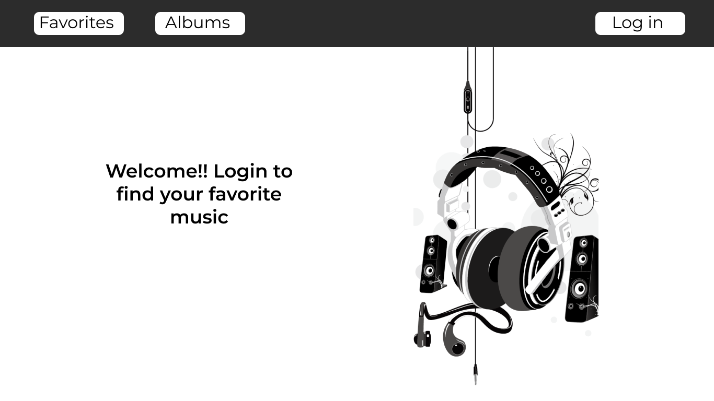
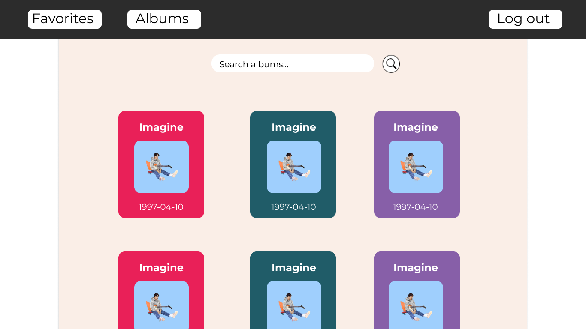
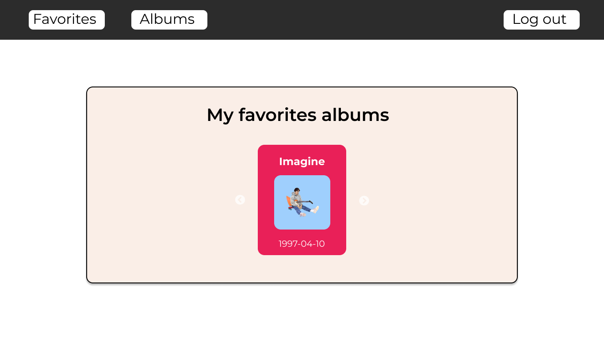
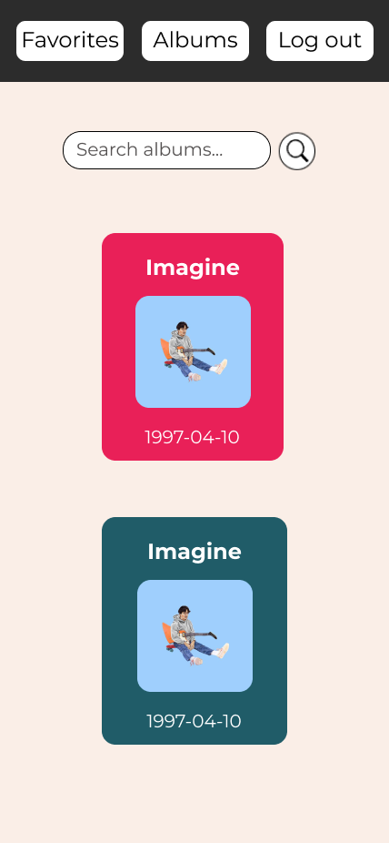
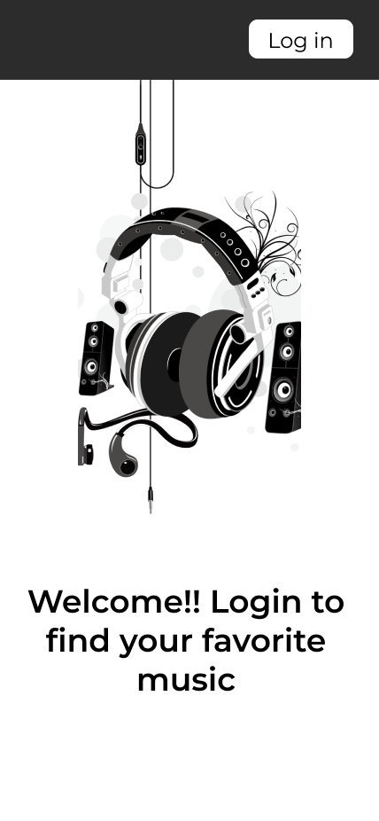

# My Music App

This is an app to search spotify albums.   
This page consumes the Spotify API to display album information.
It is made with React, Redux and some style libraries

## `Views`

There is a landingpage where you can log in, there is a section where you can search for albums uploaded to spotify.  
There is also a view that allows you to view the favorite albums of your spotify account

### `Figma`

Use figma to mockup views for both desktop and mobile.    
Below I will add the mockups:

## `Tecnologies`

